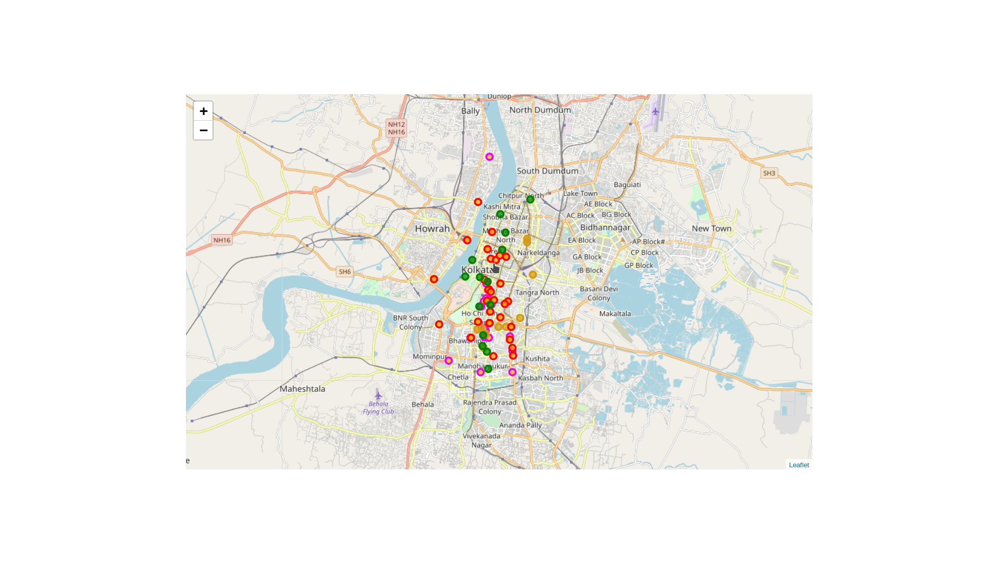
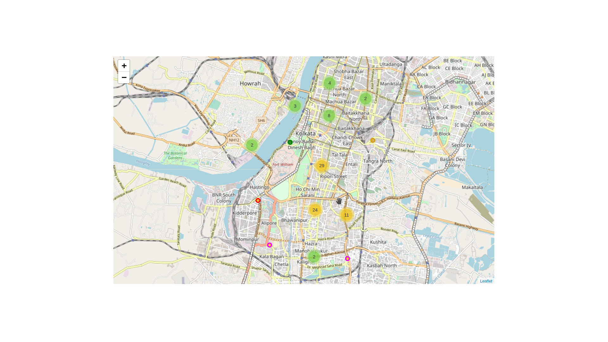

# Ultimate Dating place finder 

#### The plan :
This project deals with the finding of ultimate place to date according to the preferences. Now you can find the best place to date for any country. The idea is to use the Foursquare API to collect information about the neighbourhood of the place that is provided. So we will collect data, and make this a geo-scatter-plot. We will use k-means to cluster that to some extent to get the best place which have maximum of those preferences. The preferences are given by the user and a country/ location is selected! then we will able to visualise the best place to date.

## We have tested the data points with preferences in the city of joy! (Kolkata/India)
* ice cream
* Chinese food
* Thai food
* parks nearby to hang out

## A glance of the result is given here

#### The Scattered data points according to the preference

#### The Clustered data points according to the preference!

From the results we find that the central kolkata have the most no. of cluster to date!
Enjoy!

Author : [Jimut Bahan Pal](https://www.linkedin.com/in/jimut-bahan-pal-156862123/)
